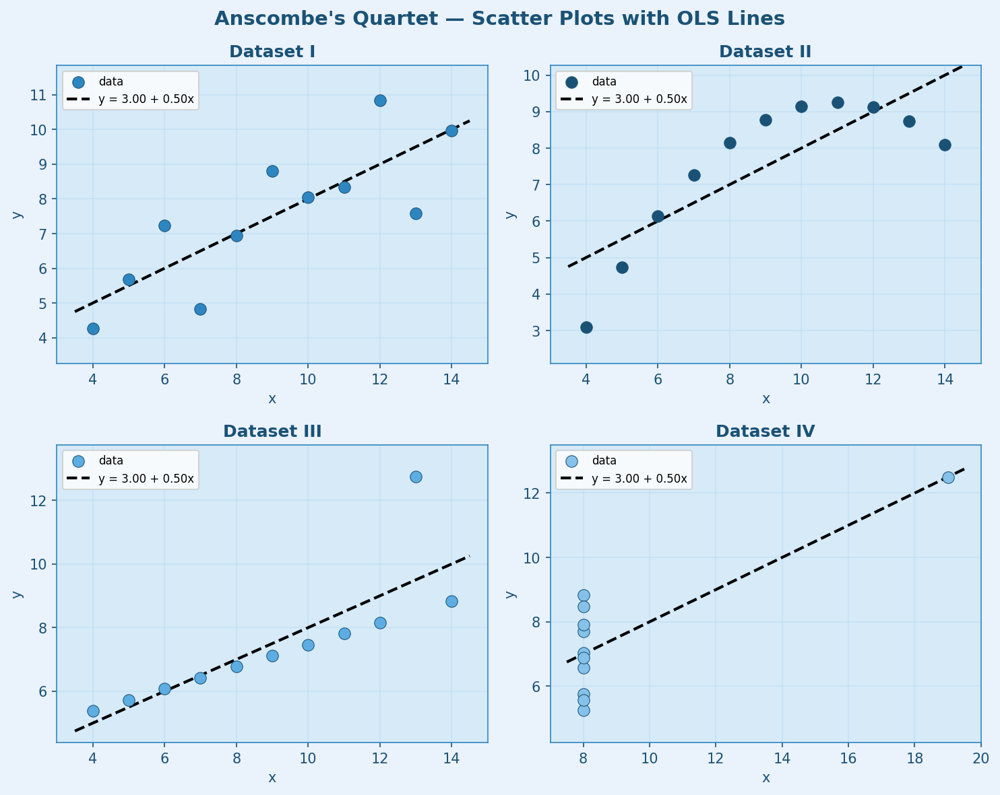
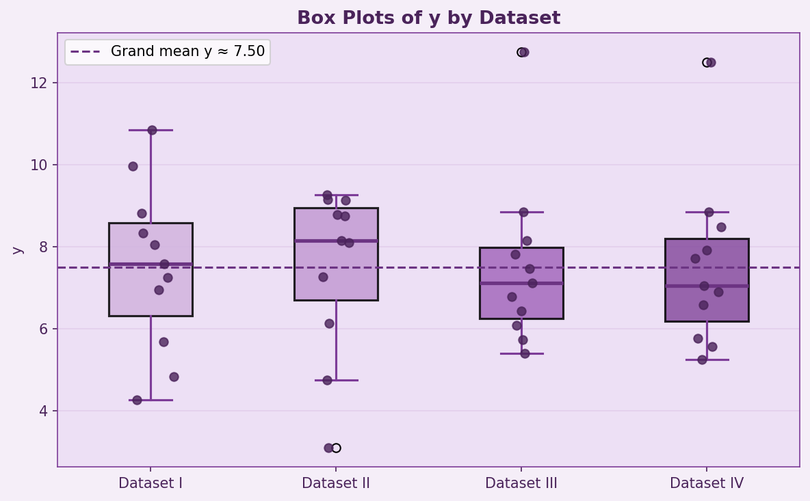
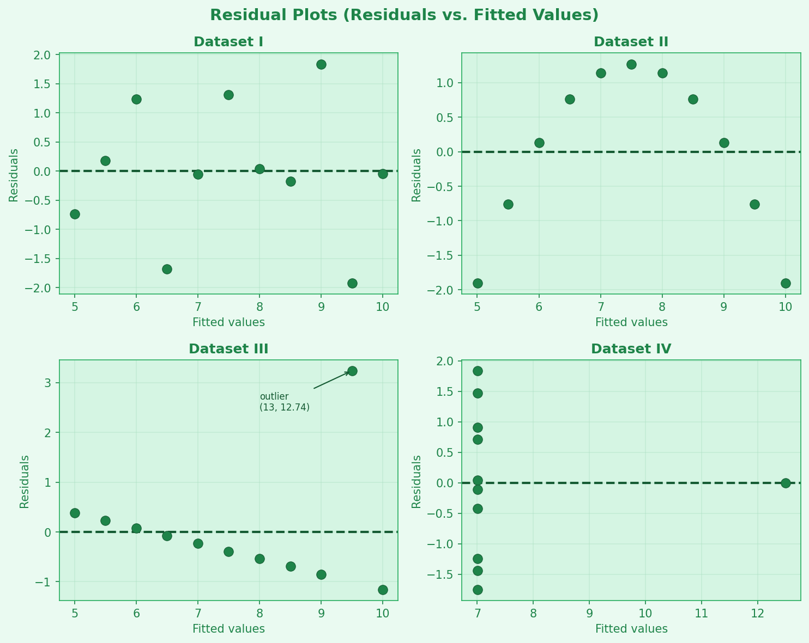

# Anscombe's Quartet — Data Analysis

A worked example of exploratory data analysis and visualisation using **Anscombe's Quartet**, a classic statistical dataset that demonstrates why visualising data matters.

---

## What is Anscombe's Quartet?

Anscombe's Quartet (Anscombe, 1973) consists of four small datasets (I–IV) that are almost identical in standard summary statistics yet reveal completely different structures when plotted:

| Dataset | Structure |
|---------|-----------|
| I | Linear relationship with random noise — a well-behaved linear model |
| II | Curved (quadratic) relationship — a linear model is the wrong form |
| III | Linear with one high-leverage outlier that distorts the fit |
| IV | Degenerate x (all points at x = 8 except one) — regression is nearly meaningless |

All four datasets share these near-identical statistics:

| Statistic | Value (all datasets) |
|-----------|----------------------|
| Mean of x | 9.0 |
| Mean of y | ≈ 7.50 |
| Std dev of x | ≈ 3.32 |
| Std dev of y | ≈ 2.03 |
| Pearson r | ≈ 0.816 |
| OLS line | y ≈ 3.00 + 0.50x |

**Key lesson:** Summary statistics alone can be deeply misleading. Always visualise your data.

---

## Repository Structure

```
.
├── anscombe_quartet.tsv      # Source data (tab-separated, 44 rows × 3 columns)
├── anscombe_analysis.ipynb   # Jupyter notebook — full analysis and plots
├── plot1_scatter.png         # Plot 1: scatter grid with OLS lines (blue theme)
├── plot2_boxplots.png        # Plot 2: box plots of y per dataset (purple theme)
├── plot3_residuals.png       # Plot 3: residual plots (green theme)
├── PLAN.md                   # Iterative analysis plan and decisions log
└── README.md                 # This file
```

---

## Notebook Overview

`anscombe_analysis.ipynb` contains four sections:

### 1. Data Loading
Reads `anscombe_quartet.tsv` with pandas and confirms the dataset structure (44 rows, datasets I–IV, 11 points each).

### 2. Descriptive Statistics
Computes per-dataset mean, standard deviation, min, max, median, Pearson r, and OLS intercept/slope — confirming the near-identical statistics across all four datasets.

### 3. Plot 1 — Scatter Grid with OLS Regression Lines *(blue theme)*
A 2×2 grid of scatter plots, one per dataset, each overlaid with the fitted OLS line (black dashed). The structural differences between datasets are immediately visible despite identical statistics.



### 4. Plot 2 — Box Plots of y per Dataset *(purple theme)*
Side-by-side box plots with individual data points overlaid (strip plot). Highlights differences in distribution shape, skew, and outliers that equal means and variances conceal.



### 5. Plot 3 — Residual Plots *(green theme)*
Residuals vs. fitted values for each OLS fit in a 2×2 grid. Residual patterns directly reveal model adequacy:
- **I** — random scatter (linear model appropriate)
- **II** — systematic curve (quadratic term missing)
- **III** — one extreme residual (influential outlier)
- **IV** — near-degenerate x (all residuals at the same fitted value)



---

## Requirements

- Python 3.8+
- `pandas`
- `numpy`
- `matplotlib`
- `jupyter` (to run the notebook interactively)

Install all dependencies in one command:

```bash
pip install pandas numpy matplotlib jupyter
```

---

## Running the Notebook

### In VS Code
1. Open `anscombe_analysis.ipynb` in the VS Code file explorer
2. Select a Python kernel when prompted (choose the environment where dependencies are installed)
3. Click **Run All** in the notebook toolbar, or press `Ctrl+Shift+P` → *Notebook: Run All Cells*

### In a terminal
```bash
jupyter notebook anscombe_analysis.ipynb
```
Then open the URL printed in the terminal (e.g. `http://localhost:8888/...`) in a browser.

### Re-execute non-interactively
```bash
jupyter nbconvert --to notebook --execute --inplace anscombe_analysis.ipynb
```

---

## Reference

Anscombe, F. J. (1973). *Graphs in Statistical Analysis*. The American Statistician, 27(1), 17–21.
